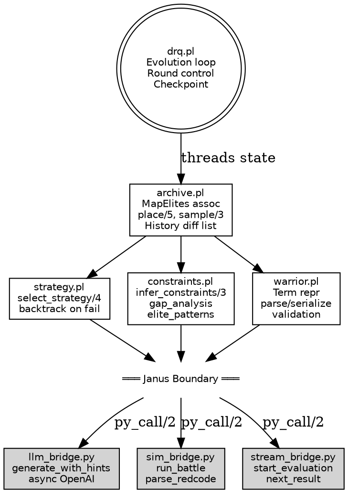

# DRQ Janus Port Design

Port Digital Red Queen to Janus, using state threading and backtracking for bidirectional reasoning.

## Overview

Prolog replaces Python orchestration. Prolog controls the evolution loop, strategy selection, and constraint inference. Python retains the Core War VM, LLM client, simulation, and async I/O.

## Architectural Decisions

| Decision | Choice | Rationale |
|----------|--------|-----------|
| Archive | Threaded state | Pure logic, safe backtracking |
| Warriors | Full Prolog terms | Maximum reasoning power |
| Parallelism | Async streaming | Flexible early stopping |
| LLM integration | Constraint-driven | Backward reasoning from goals |

## System Architecture



**Key invariant**: Prolog predicates thread all state as explicit arguments. The Python layer holds no state.

## Data Flow

### Main Evolution Loop

```prolog
evolve(Config, FinalState) :-
    empty_state(State0),
    load_initial_opponents(Config, Opponents),
    evolve_rounds(Config, Opponents, 0, State0, FinalState).

evolve_rounds(Config, _, Round, S, S) :-
    Round >= Config.n_rounds.
evolve_rounds(Config, Opponents, Round, S0, S) :-
    Round < Config.n_rounds,
    run_round(Config, Opponents, Round, S0, S1),
    checkpoint(Config, Round, S1),
    get_best(Round, S1, Champion),
    NextRound is Round + 1,
    evolve_rounds(Config, [Champion|Opponents], NextRound, S1, S).
```

### Single Round with Streaming

```prolog
run_round(Config, Opponents, Round, S0, S) :-
    init_batch(Config, Round, S0, Batch, S1),
    start_stream(Batch, Opponents, StreamId),
    process_results(StreamId, Round, S1, S).

start_stream(Warriors, Opponents, StreamId) :-
    maplist(warrior_to_dict, Warriors, WDicts),
    opponents_to_dicts(Opponents, ODicts),
    py_call(stream_bridge:start_evaluation(WDicts, ODicts), StreamId).

process_results(StreamId, Round, S0, S) :-
    py_call(stream_bridge:next_result(StreamId), Result),
    ( Result = py{status: done}
    -> S = S0
    ; Result = py{status: error, warrior_id: Id, msg: Msg}
    -> record_warrior_error(Id, Msg, S0, S1),
       process_results(StreamId, Round, S1, S)
    ; Result = py{warrior_id: Id, fitness: F, bc: BC, metrics: M}
    -> update_warrior_metrics(Id, F, BC, M, S0, S1),
       place(Round, BC, Id, F, S1, S2),
       process_results(StreamId, Round, S2, S)
    ).
```

### Constraint-Driven Generation with Backtracking

```prolog
generate_warrior(Config, Round, S0, Warrior, S) :-
    select_strategy(Config, Round, S0, Strategy),
    infer_constraints(Strategy, S0, Constraints),
    attempt_generation(Config, Constraints, S0, Warrior, S1),
    validate_warrior(Warrior, Constraints),
    record_generation(Warrior, S1, S).

%% Strategy selection with explicit choice points
select_strategy(_Config, Round, State, fill_gap(Gap)) :-
    archive_has_gaps(Round, State, Gaps),
    member(Gap, Gaps).
select_strategy(_Config, Round, State, mutate(Elite)) :-
    \+ archive_has_gaps(Round, State, _),
    sample_elite(Round, State, Elite).
select_strategy(_Config, Round, State, generate_new) :-
    \+ archive_has_gaps(Round, State, _),
    \+ sample_elite(Round, State, _).

attempt_generation(_Config, Constraints, S, Warrior, S1) :-
    constraints_to_hints(Constraints, Hints),
    py_call(llm_bridge:generate_with_hints(Hints), Response),
    parse_warrior_response(Response, Warrior, S, S1).
```

### State Threading

```dot
digraph STATE_THREADING {
    rankdir=LR;
    node [fontname="Helvetica", fontsize=10];

    // States (ellipse)
    State0 [label="State0" shape=ellipse];
    State1 [label="State1" shape=ellipse];
    State2 [label="State2" shape=ellipse];
    backtrack [label="Backtrack" shape=ellipse];

    // Actions (box)
    generate [label="Generate warrior" shape=box];
    attempt [label="Attempt generation" shape=box];
    parse [label="Parse response" shape=box];
    record [label="Record generation" shape=box];
    place [label="Place in archive" shape=box];

    // Decisions (diamond)
    validate [label="Valid?" shape=diamond];

    // Flow
    State0 -> generate;
    generate -> attempt [label="strategy"];
    attempt -> parse [label="LLM call"];
    parse -> validate;
    validate -> record [label="yes"];
    validate -> backtrack [label="no"];
    backtrack -> generate [style=dashed label="next strategy"];
    record -> State1;
    State1 -> place;
    place -> State2 [label="if elite"];
}
```



## Error Handling

### Error Categories

| Type | Source | Recovery |
|------|--------|----------|
| Validation failed | `validate_warrior/2` | Backtrack to next strategy |
| Parse failed | `parse_warrior_response/2` | Backtrack to next strategy |
| Rate limit | Python LLM client | Retry with exponential backoff |
| Timeout | Python simulation | Record failure, continue batch |
| Stream error | Python ProcessPool | Cancel stream, keep partial results |
| Fatal | Unhandled exception | Log, checkpoint, exit |

### Recoverable Errors (Backtracking)

```prolog
generate_warrior(Config, Round, S0, Warrior, S) :-
    select_strategy(Config, Round, S0, Strategy),
    infer_constraints(Strategy, S0, Constraints),
    attempt_generation(Config, Constraints, S0, Warrior, S1),
    validate_warrior(Warrior, Constraints),
    record_generation(Warrior, S1, S).
%% Validation failure triggers backtracking to next strategy via select_strategy/4
```

### Retryable Errors (LLM/Network)

```prolog
attempt_with_retry(_, 0, _, _, _) :-
    throw(error(retry_exhausted, context(llm_generation, "Max retries exceeded"))).
attempt_with_retry(Constraints, N, Response, S0, S) :-
    N > 0,
    constraints_to_hints(Constraints, Hints),
    catch(
        py_call(llm_bridge:generate_with_hints(Hints), Response),
        PythonError,
        handle_python_error(PythonError, Constraints, N, Response, S0, S)
    ).

handle_python_error(PythonError, Constraints, N, Response, S0, S) :-
    classify_error(PythonError, retryable),
    N1 is N - 1,
    record_retry(PythonError, S0, S1),
    attempt_with_retry(Constraints, N1, Response, S1, S).
handle_python_error(PythonError, _, _, _, _, _) :-
    classify_error(PythonError, fatal),
    throw(PythonError).

classify_error(py_error('RateLimitError', _), retryable).
classify_error(py_error('APIConnectionError', _), retryable).
classify_error(py_error('Timeout', _), retryable).
classify_error(_, fatal).
```

### Stream Error Recovery

```prolog
process_results(StreamId, Round, S0, S) :-
    catch(
        py_call(stream_bridge:next_result(StreamId), Result),
        StreamError,
        handle_stream_error(StreamError, StreamId, Round, S0, S)
    ),
    process_result(Result, StreamId, Round, S0, S).

handle_stream_error(Error, StreamId, Round, S0, S) :-
    py_call(stream_bridge:cancel(StreamId), _),
    record_stream_failure(Error, Round, S0, S1),
    S = S1.  % Degrade gracefully: retain partial results
```

## Testing

### Test Structure

```
tests/
├── prolog/
│   ├── test_archive.pl      # Pure state operations
│   ├── test_strategy.pl     # Strategy selection + backtracking
│   ├── test_constraints.pl  # Constraint inference
│   ├── test_warrior.pl      # Term manipulation
│   └── test_integration.pl  # Full round with mocked Python
├── python/
│   ├── test_llm_bridge.py   # LLM client isolation
│   ├── test_sim_bridge.py   # Simulation wrapper
│   └── test_stream_bridge.py # Async streaming
└── e2e/
    └── test_evolution.pl    # Full evolution run
```

### Archive Unit Tests

```prolog
:- begin_tests(archive).

test(empty_archive) :-
    empty_state(S),
    \+ get_best(0, S, _).

test(place_single) :-
    empty_state(S0),
    place(0, bc(1,2), warrior_1, 0.5, S0, S1),
    get_best(0, S1, Best),
    Best = entry(warrior_1, 0.5).

test(place_replaces_inferior) :-
    empty_state(S0),
    place(0, bc(1,2), warrior_1, 0.5, S0, S1),
    place(0, bc(1,2), warrior_2, 0.7, S1, S2),
    get_best(0, S2, Best),
    Best = entry(warrior_2, 0.7).

test(place_keeps_superior) :-
    empty_state(S0),
    place(0, bc(1,2), warrior_1, 0.8, S0, S1),
    place(0, bc(1,2), warrior_2, 0.6, S1, S2),
    get_best(0, S2, Best),
    Best = entry(warrior_1, 0.8).

:- end_tests(archive).
```

### Strategy Backtracking Tests

```prolog
:- begin_tests(strategy_backtracking).

test(backtrack_on_failure, [nondet]) :-
    empty_state(S0),
    place(0, bc(0,1), w1, 0.5, S0, S1),
    findall(Strat, select_strategy(config{}, 0, S1, Strat), Strategies),
    member(fill_gap(bc(0,0)), Strategies),
    member(fill_gap(bc(1,1)), Strategies).

test(fallback_to_mutation) :-
    full_archive(S),
    select_strategy(config{}, 0, S, Strategy),
    Strategy = mutate(_).

:- end_tests(strategy_backtracking).
```

### Python Bridge Tests

```python
# test_llm_bridge.py
def test_generate_with_hints_success(mock_openai):
    mock_openai.chat.completions.create = AsyncMock(
        return_value=Mock(choices=[Mock(message=Mock(
            content="ORG start\nstart: MOV 0,1\nEND"
        ))])
    )
    hints = {"required_opcodes": ["mov"], "min_length": 1}
    result = generate_with_hints(hints)
    assert "MOV" in result

def test_generate_retries_on_rate_limit(mock_openai):
    mock_openai.chat.completions.create = AsyncMock(
        side_effect=[RateLimitError("rate limited"),
                     Mock(choices=[Mock(message=Mock(content="valid"))])]
    )
    result = generate_with_hints({})
    assert result == "valid"
    assert mock_openai.chat.completions.create.call_count == 2
```

### Test Execution

```bash
# Prolog tests
swipl -g "run_tests" -t halt tests/run_all.pl

# Python tests
uv run pytest tests/python/ -v

# Full suite
make test
```

### Coverage Goals

| Component | Target | Strategy |
|-----------|--------|----------|
| archive.pl | 100% | All state transitions |
| strategy.pl | 90% | All choice points exercised |
| constraints.pl | 95% | All constraint combinations |
| Python bridges | 85% | Mock external services |
| Integration | 80% | Happy path + error recovery |

## File Structure

```
drq/
├── src/
│   ├── prolog/
│   │   ├── drq.pl           # Entry point, evolution loop
│   │   ├── archive.pl       # Pure MapElites state
│   │   ├── strategy.pl      # Strategy selection
│   │   ├── constraints.pl   # Constraint inference
│   │   └── warrior.pl       # Warrior term operations
│   └── python/
│       ├── llm_bridge.py    # LLM client wrapper
│       ├── sim_bridge.py    # Core War simulation
│       └── stream_bridge.py # Async result streaming
├── corewar/                  # Unchanged: VM + parser
├── tests/
│   ├── prolog/
│   └── python/
└── docs/
    └── plans/
```

## Migration Path

1. **Phase 1**: Implement `archive.pl` with pure state threading
2. **Phase 2**: Implement `warrior.pl` term representation and serialization
3. **Phase 3**: Implement Python bridges (`sim_bridge.py`, `stream_bridge.py`)
4. **Phase 4**: Implement `strategy.pl` with backtracking
5. **Phase 5**: Implement `constraints.pl` with elite pattern extraction
6. **Phase 6**: Implement `llm_bridge.py` with constraint-to-hints translation
7. **Phase 7**: Wire up `drq.pl` entry point
8. **Phase 8**: Integration testing and checkpoint compatibility

## Janus Interop Conventions

### Term Conversion

Prolog terms crossing the Janus boundary follow these patterns:

| Prolog Term | Python Type | Converter |
|-------------|-------------|-----------|
| `warrior(Id, Source, Meta)` | `dict` | `warrior_to_dict/2` |
| `bc(TSP, MC)` | `tuple` | Direct unification |
| `[Constraint|Cs]` | `list` | `constraints_to_hints/2` |
| `py{key: Value}` | `dict` | Janus dict literal |

### Async Interop

Python async functions wrap in synchronous bridge functions using `asyncio.run()`. The streaming pattern uses an iterator interface:

```python
# stream_bridge.py
def start_evaluation(warriors, opponents):
    """Return stream ID; results via next_result()."""
    stream = AsyncStream(warriors, opponents)
    return register_stream(stream)

def next_result(stream_id):
    """Block until next result ready."""
    return get_stream(stream_id).next()
```

### Python Exception Mapping

Python exceptions appear in Prolog as `py_error(Type, Message)`:

| Python Exception | Prolog Pattern |
|-----------------|----------------|
| `openai.RateLimitError` | `py_error('RateLimitError', _)` |
| `openai.APIConnectionError` | `py_error('APIConnectionError', _)` |
| `TimeoutError` | `py_error('Timeout', _)` |

## Dependencies

### Prolog
- SWI-Prolog 9.0+ (Janus support)
- library(janus)
- library(assoc)
- library(plunit)

### Python
- janus-swi
- openai (async client)
- multiprocessing

## Open Questions

1. **Checkpoint format**: Serialize Prolog state to JSON or keep pickle for Python objects?
2. **BC binning**: Port binning logic to Prolog or call Python utility?
3. **History limits**: Cap difference list length or allow unbounded growth?
